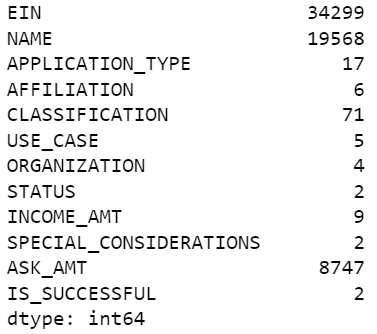
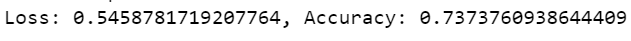

## Overview
The nonprofit foundation Alphabet Soup wants a tool that can help it select the applicants for funding with the best chance of success in their ventures. This project utilizes machine learning and neural networks to create a binary classifier that can predict whether applicants will be successful if funded by Alphabet Soup.

## Results
### Data Preprocessing
- What variable is the target for your model?
    - The target for this model is success, stored as a boolean value in the "IS_SUCCESSFUL" data column.
- What variables are the features for your model?
    - The features for this model are the remaining data columns once "IS_SUCCESSFUL" has been removed from the data. 
- What variables should be removed from the input data because they are neither targets nor features?
    - Both the "NAME" and "EIN" columns have been removed from the input data, as the range of unique values prevents efficient binning of the values.
    

### Compiling, Training and Evaluation
- How many neurons, layers, and activation functions did you select for your neural network model, and why?
    - I used three hidden layers, one with 10 neurons, 15 neurons, and 20 neurons, all with the "relu" activation function. I wanted to double the number of neurons from the first hidden layer. I also added a fourth "sigmoid" layer with 1 neuron. 
- Were you able to achieve the target model performance?
    - Unfortunately the model fell short of 75% performance, only reaching 73.6% with optimization efforts.
    
- What steps did you take in your attempts to increase model performance?
    - Increased the number of bins for the values we sorted during data preprocessing.
    - Created an addition hidden layer and increased the number of neurons in each layer.
    - Increased number of epochs when training the model.

## Summary 
Overall, the model unperformed the target accuracy in predicting successful outcomes from the Alphabet Soup Charity dataset. Due to the complexity of the data, I would recommend the development of a random forest model. This model will be more interpretable with less processing behind the scenes. A random forest model can also handle categorical features, meaning less preprocessing and less resource usage. 

